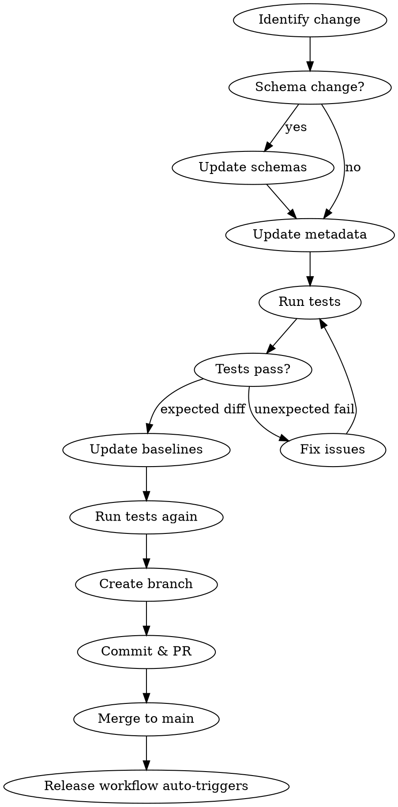

# Labs Content Update

## Overview

Workflow for updating Copilot Labs experiment configurations, syncing schema changes from Studio repository, and publishing through the pipeline.

## When to Use

- Updating experiment metadata (title, description, links, covers)
- Syncing schema changes from `infinity-microsoft/studio` PRs
- Adding new experiments
- Publishing content to staging or production

## Content Pipeline

```text
original/ → generated/ → dist/ → publish
```

| Stage | Directory | Description |
|-------|-----------|-------------|
| Source | `content/original/{experiment}/` | metadata.json + landing-page.md |
| Build | `content/generated/` | Intermediate configs |
| Release | `content/dist/` | Merged configs by locale |
| Publish | picasso-assets / studio | CDN and frontend repos |

## Update Workflow



## Quick Reference

### File Locations

| File | Purpose |
|------|---------|
| `content/original/{exp}/metadata.json` | Experiment configuration |
| `content/original/{exp}/landing-page.md` | Landing page content |
| `content/config.schema.json` | Schema for generated configs |
| `content/metadata.schema.json` | Schema for source metadata |
| `settings.json` | Experiment IDs and enabled flags |

### Commands

```bash
# Install dependencies
npm install

# Run integration tests
npm run test:integration

# Update baselines (after expected changes)
npm run test:update-integration-baselines

# E2E tests
npm run test:e2e
```

## Schema Sync from Studio

When a Studio PR changes `src/schemas/labs-schemas.ts`:

1. **Analyze the PR** - Use `gh pr view` and `gh pr diff`
2. **Map Zod to JSON Schema**:
   - `z.enum([...])` → `"enum": [...]`
   - `z.literal("X")` → `"const": "X"`
   - `z.union([A, B])` → `"oneOf": [{...}, {...}]`
   - `z.object({...}).extend({...})` → `"allOf": [{...}, {...}]`
3. **Update both schemas**:
   - `content/config.schema.json`
   - `content/metadata.schema.json`
4. **Update affected experiments** in `content/original/`

## Publishing

### CRITICAL: Use Release Branch

Publish workflows MUST run on a `release/*` branch, NOT `main`.

```bash
# Find the latest release branch
git fetch origin
git branch -r | grep release | tail -1

# Trigger staging (replace with actual branch)
gh workflow run "Publish: Staging" --repo infinity-microsoft/labs-content \
  --ref release/YYYY-MM-DD-HHMMSS

# After staging verification, trigger production
gh workflow run "Publish: Production" --repo infinity-microsoft/labs-content \
  --ref release/YYYY-MM-DD-HHMMSS
```

### Workflow Sequence

| Step | Workflow | Trigger | Branch |
|------|----------|---------|--------|
| 1 | Release | Auto on push to main | main |
| 2 | Publish: Staging | Manual | release/* |
| 3 | Publish: Production | Manual | release/* |

### Staging Publishes To

- **picasso-assets**: `staging.config.json` + media files
- Creates PR for review

### Production Publishes To

- **picasso-assets**: `prod.config.json`
- **studio**: markdown files, strings, fallback config
- Creates PRs for review

## Common Mistakes

| Mistake | Fix |
|---------|-----|
| Run Publish on `main` branch | Use `release/*` branch - main has no `dist/` |
| Push directly to main | Create feature branch and PR |
| Forget to update baselines | Run `npm run test:update-integration-baselines` |
| Miss schema file | Update BOTH `config.schema.json` AND `metadata.schema.json` |
| Wrong GitHub account | Use `gh auth switch --user shuyumao_microsoft` |

## Checklist

- [ ] Switch to correct GitHub account (`gh auth status`)
- [ ] Create feature branch (not direct to main)
- [ ] Update schema files (if schema change)
- [ ] Update experiment metadata
- [ ] Run `npm run test:integration`
- [ ] Update baselines if needed
- [ ] Commit with descriptive message
- [ ] Create PR and get review
- [ ] After merge, find release branch
- [ ] Trigger Publish: Staging on release branch
- [ ] Verify staging
- [ ] Trigger Publish: Production on release branch
