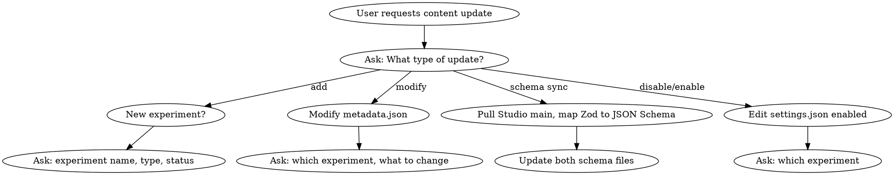
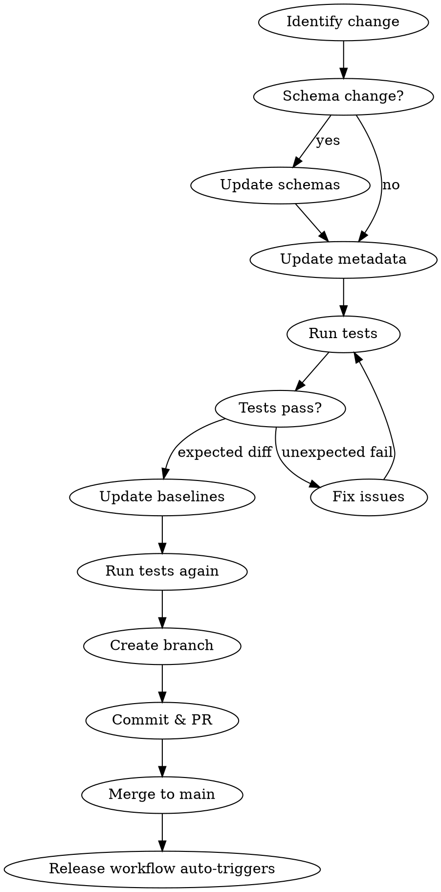

# Labs Content Update

## Overview

Workflow for updating Copilot Labs experiment configurations, syncing schema changes from Studio repository, and publishing through the pipeline.

## When to Use

- Updating experiment metadata (title, description, links, covers)
- Syncing schema changes from `infinity-microsoft/studio` PRs
- Adding new experiments
- Disabling/enabling experiments
- Publishing content to staging or production

## First: Ask What Type of Update

**ALWAYS ask the user which operation they need:**

| Operation | Files to Modify | Special Steps |
|-----------|-----------------|---------------|
| **Add new experiment** | Create `content/original/{name}/` with metadata.json + landing-page.md, update `settings.json` | Allocate new ID in settings.json |
| **Modify experiment** | Edit `content/original/{name}/metadata.json` or `landing-page.md` | None |
| **Sync schema from Studio** | Update `config.schema.json` + `metadata.schema.json`, may update multiple experiments | Pull Studio main branch first |
| **Disable experiment** | Set `enabled: false` in `settings.json` | Content stays, just hidden |
| **Enable experiment** | Set `enabled: true` in `settings.json` | Content must exist |
| **Update covers/media** | Edit `covers` array in metadata.json | URLs must be uploaded to CDN first |

### Decision Flow



## Content Pipeline

```text
original/ → generated/ → dist/ → publish
```

| Stage | Directory | Description |
|-------|-----------|-------------|
| Source | `content/original/{experiment}/` | metadata.json + landing-page.md |
| Build | `content/generated/` | Intermediate configs |
| Release | `content/dist/` | Merged configs by locale |
| Publish | picasso-assets / studio | CDN and frontend repos |

## Update Workflow



## Quick Reference

### File Locations

| File | Purpose |
|------|---------|
| `content/original/{exp}/metadata.json` | Experiment configuration |
| `content/original/{exp}/landing-page.md` | Landing page content |
| `content/config.schema.json` | Schema for generated configs |
| `content/metadata.schema.json` | Schema for source metadata |
| `settings.json` | Experiment IDs and enabled flags |

### Commands

```bash
# Install dependencies
npm install

# Run integration tests
npm run test:integration

# Update baselines (after expected changes)
npm run test:update-integration-baselines

# E2E tests
npm run test:e2e
```

## Schema Sync from Studio

When Studio's `src/schemas/labs-schemas.ts` changes:

1. **Pull Studio main branch** to see latest schema
2. **Map Zod to JSON Schema**:
   - `z.enum([...])` → `"enum": [...]`
   - `z.literal("X")` → `"const": "X"`
   - `z.union([A, B])` → `"oneOf": [{...}, {...}]`
   - `z.object({...}).extend({...})` → `"allOf": [{...}, {...}]`
3. **Update both schemas**:
   - `content/config.schema.json`
   - `content/metadata.schema.json`
4. **Update affected experiments** in `content/original/`

## Add New Experiment

1. **Create directory**: `content/original/{experiment-name}/`
2. **Create metadata.json** with required fields:
   - `name`, `alias`, `type` (FEATURE/PROJECT), `status`, `assets`
3. **Create landing-page.md** with experiment description
4. **Register in settings.json**:
   - Add entry with unique `id` (increment from highest existing)
   - Set `enabled: true`
5. Run tests and update baselines

## Disable/Enable Experiment

Edit `settings.json`:

```json
{
  "experiments": {
    "experiment-name": {
      "id": "X",
      "enabled": false  // or true to enable
    }
  }
}
```

**Note**: Disabling keeps content intact, just excludes from dist output.

## Update Covers/Media

Covers are images or videos displayed on homepage and landing pages.

### Media Upload Flow

```text
content/original/{exp}/*.jpg  →  content/dist/  →  picasso-assets  →  CDN
```

**可以一次完成**：媒体文件和 metadata.json 可以同时更新，因为 URL 是可预测的。

### Steps

1. **Place media file** in `content/original/{experiment}/` directory
2. **Update metadata.json** with the predictable CDN URL:

   ```text
   https://copilot.microsoft.com/static/copilotlabs/{filename}
   ```

3. **Run tests** - build-configs.js copies media to `content/generated/`
4. **Merge to main** - release.js copies media to `content/dist/`
5. **Publish Staging with `--sync-media`** - syncs media to picasso-assets
6. **After picasso-assets PR merges** - Media available at CDN URL

### Update metadata.json

After media is on CDN, update the `covers` array:

```json
"covers": [
  {
    "type": "IMAGE",
    "url": "https://copilot.microsoft.com/static/copilotlabs/{experiment}-cover-image.jpg",
    "consumers": ["HOMEPAGE"]
  },
  {
    "type": "VIDEO",
    "url": "https://copilot.microsoft.com/static/copilotlabs/{experiment}-cover-video.mp4",
    "width": 1920,
    "height": 930,
    "consumers": ["LANDING_PAGE"]
  }
]
```

### Cover Types

| Type | Use Case | Required Fields |
|------|----------|-----------------|
| `IMAGE` | Static thumbnail | `type`, `url`, `consumers` |
| `VIDEO` | Animated preview | `type`, `url`, `width`, `height`, `consumers` |

### Consumer Types

| Consumer | Where it appears |
|----------|------------------|
| `HOMEPAGE` | Labs homepage grid |
| `LANDING_PAGE` | Experiment detail page |

### Supported Formats

| Images | Videos |
|--------|--------|
| .png, .jpg, .jpeg, .gif, .webp, .svg | .mp4, .webm, .mov |

**Note**: One experiment can have multiple covers for different consumers and sizes.

## Publishing

### CRITICAL: Use Release Branch

Publish workflows MUST run on a `release/*` branch, NOT `main`.

```bash
# Find the latest release branch
git fetch origin
git branch -r | grep release | tail -1

# Trigger staging (replace with actual branch)
gh workflow run "Publish: Staging" --repo infinity-microsoft/labs-content \
  --ref release/YYYY-MM-DD-HHMMSS

# After staging verification, trigger production
gh workflow run "Publish: Production" --repo infinity-microsoft/labs-content \
  --ref release/YYYY-MM-DD-HHMMSS
```

### Workflow Sequence

| Step | Workflow | Trigger | Branch |
|------|----------|---------|--------|
| 1 | Release | Auto on push to main | main |
| 2 | Publish: Staging | Manual | release/* |
| 3 | Publish: Production | Manual | release/* |

### Staging Publishes To

- **picasso-assets**: `staging.config.json` + media files (使用 `--sync-media`)
- Creates PR for review
- **一次 Publish 同时更新内容和媒体**

### Production Publishes To

- **picasso-assets**: `prod.config.json`
- **studio**: markdown files, strings, fallback config
- Creates PRs for review

## Common Mistakes

| Mistake | Fix |
|---------|-----|
| Run Publish on `main` branch | Use `release/*` branch - main has no `dist/` |
| Push directly to main | Create feature branch and PR |
| Forget to update baselines | Run `npm run test:update-integration-baselines` |
| Miss schema file | Update BOTH `config.schema.json` AND `metadata.schema.json` |

## Checklist

- [ ] Create feature branch (not direct to main)
- [ ] Update schema files (if schema change)
- [ ] Update experiment metadata
- [ ] Run `npm run test:integration`
- [ ] Update baselines if needed
- [ ] Commit with descriptive message
- [ ] Create PR and get review
- [ ] After merge, find release branch
- [ ] Trigger Publish: Staging on release branch
- [ ] Verify staging
- [ ] Trigger Publish: Production on release branch
