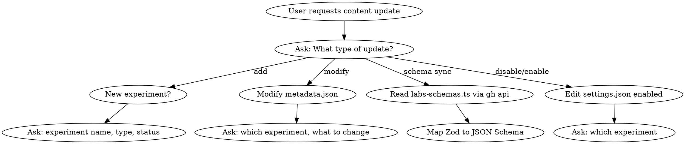
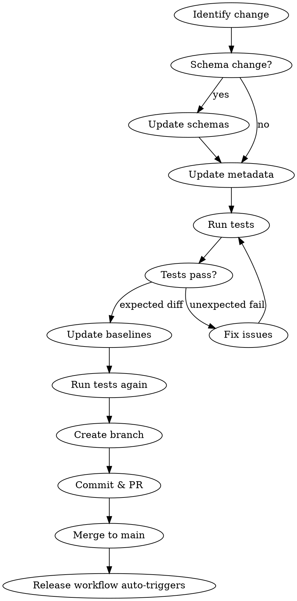

# Labs Content Update

## Overview

Workflow for updating Copilot Labs experiment configurations, syncing schema changes from Studio repository, and publishing through the pipeline.

## When to Use

- Updating experiment metadata (title, description, links, covers)
- Syncing schema changes from `infinity-microsoft/studio` PRs
- Adding new experiments
- Disabling/enabling experiments
- Publishing content to staging or production

## First: Ask What Type of Update

**ALWAYS ask the user which operation they need:**

| Operation | Files to Modify | Special Steps |
|-----------|-----------------|---------------|
| **Add new experiment** | Create `content/original/{name}/` with metadata.json + landing-page.md, update `settings.json` | Allocate new ID in settings.json |
| **Modify experiment** | Edit `content/original/{name}/metadata.json` or `landing-page.md` | None |
| **Sync schema from Studio** | Update `config.schema.json` + `metadata.schema.json`, may update multiple experiments | Read via `gh api` |
| **Disable experiment** | Set `enabled: false` in `settings.json` | Content stays, just hidden |
| **Enable experiment** | Set `enabled: true` in `settings.json` | Content must exist |
| **Update covers/media** | Edit `covers` array in metadata.json | URLs must be uploaded to CDN first |

### Decision Flow



## Content Pipeline

```text
original/ → generated/ → dist/ → publish
```

| Stage | Directory | Description |
|-------|-----------|-------------|
| Source | `content/original/{experiment}/` | metadata.json + landing-page.md |
| Build | `content/generated/` | Intermediate configs |
| Release | `content/dist/` | Merged configs by locale |
| Publish | picasso-assets / studio | CDN and frontend repos |

## Update Workflow

### Complete Flow (Claude Automates Most Steps)

| Step | Who | Action |
|------|-----|--------|
| 0 | Claude | Check if Studio schema needs sync |
| 1 | Claude asks | Collect info: what to update, new values |
| 2 | Claude | Sync schema if needed |
| 3 | Claude | Edit files based on user input |
| 4 | Claude | Run `npm run test:integration` |
| 5 | Claude | Update baselines if needed |
| 6 | Claude | Create branch, commit, push, create PR |
| 7 | Claude | **Tell user labs-content PR URL, remind to merge** |
| 8 | Claude | **Watch labs-content PR until merged** |
| 9 | Claude | **Watch Release workflow until complete** |
| **Staging** | | |
| 10 | Claude | **Trigger Publish: Staging automatically** |
| 11 | Claude | **Watch Staging workflow until complete** |
| 12 | Claude | **Tell user picasso-assets staging PR URL, remind to merge** |
| 13 | Claude | **Watch picasso-assets PR until merged** |
| 14 | Claude | **Watch picasso-assets workflow until complete** |
| 15 | Claude | **Tell user to verify at <https://www.copilot-stg.com/labs>** |
| 16 | Claude asks | "Staging verified. Publish to Production?" |
| **Production** | | |
| 17 | Claude | **Trigger Publish: Production** |
| 18 | Claude | **Watch Production workflow until complete** |
| 19 | Claude | **Tell user picasso-assets prod PR URL, remind to merge** |
| 20 | Claude | **Watch picasso-assets PR until merged** |
| 21 | Claude | **Watch picasso-assets workflow until complete** |
| 22 | Claude | **Tell user studio PR URL, remind to merge** |
| 23 | Claude | **Watch studio PR until merged** |
| 24 | Claude | **Tell user: "Production published! Verify at <https://www.copilot.microsoft.com/labs>"** |

### Watch PR Merge Status

Poll PR every **1 hour** until merged (PR merge depends on reviewer):

```bash
# Check PR state
gh pr view <pr-number> --repo <repo> --json state,mergedAt

# state: "OPEN" | "CLOSED" | "MERGED"
```

### Watch Workflow

Use `gh run watch` to block until complete (workflows are fast, ~30s-2min):

```bash
# Get latest workflow run ID
gh run list --repo <repo> --workflow "<workflow-name>" --limit 1 --json databaseId --jq '.[0].databaseId'

# Watch until complete (blocks)
gh run watch <run-id> --repo <repo>
```

### Flowchart



## Repositories and Workflows

### Repositories

| Repo | Purpose |
|------|---------|
| `infinity-microsoft/labs-content` | Content source |
| `infinity-microsoft/picasso-assets` | CDN assets |
| `infinity-microsoft/studio` | Frontend (schema source + production target) |

### labs-content Workflows

| Workflow | Trigger | Purpose |
|----------|---------|---------|
| `Release` | Auto on push to main | Creates release branch with dist/ |
| `Publish: Staging` | Manual | Syncs to picasso-assets staging |
| `Publish: Production` | Manual | Syncs to picasso-assets + studio prod |
| `Integration Tests` | PR / push to main | Validates config builds |

### picasso-assets Workflows

| Workflow | Trigger | Purpose |
|----------|---------|---------|
| `Detect files to upload` | PR merge | Uploads files to CDN |

### Watching Workflows

```bash
# labs-content workflows
gh run list --repo infinity-microsoft/labs-content --workflow "Release" --limit 1
gh run list --repo infinity-microsoft/labs-content --workflow "Publish: Staging" --limit 1
gh run list --repo infinity-microsoft/labs-content --workflow "Publish: Production" --limit 1

# picasso-assets workflows
gh run list --repo infinity-microsoft/picasso-assets --workflow "Detect files to upload" --limit 1
```

## Quick Reference

### File Locations

| File | Purpose |
|------|---------|
| `content/original/{exp}/metadata.json` | Experiment configuration |
| `content/original/{exp}/landing-page.md` | Landing page content |
| `content/config.schema.json` | Schema for generated configs |
| `content/metadata.schema.json` | Schema for source metadata |
| `settings.json` | Experiment IDs and enabled flags |

### Commands

```bash
# Install dependencies
npm install

# Run integration tests
npm run test:integration

# Update baselines (after expected changes)
npm run test:update-integration-baselines

# E2E tests
npm run test:e2e
```

## Schema Sync from Studio

When Studio's `src/schemas/labs-schemas.ts` changes:

1. **Read schema file directly via gh**:

   ```bash
   gh api repos/infinity-microsoft/studio/contents/src/schemas/labs-schemas.ts \
     --jq '.content' | base64 -d
   ```

2. **Map Zod to JSON Schema**:
   - `z.enum([...])` → `"enum": [...]`
   - `z.literal("X")` → `"const": "X"`
   - `z.union([A, B])` → `"oneOf": [{...}, {...}]`
   - `z.object({...}).extend({...})` → `"allOf": [{...}, {...}]`
3. **Update both schemas**:
   - `content/config.schema.json`
   - `content/metadata.schema.json`
4. **Update affected experiments** in `content/original/`

## Add New Experiment

### Step-by-Step: Ask User for Each Field

**MUST ask user these questions in order:**

1. **Experiment name?** (e.g., "Copilot Vision")
2. **Alias?** (URL slug, e.g., "copilot-vision")
3. **Type?** FEATURE or PROJECT
4. **Status?** UPCOMING, LIVE, GRADUATED, etc.
5. **Short description?** (1-2 sentences)
6. **Landing page content?** (can be placeholder initially)
7. **Cover image URL?** (or will upload new image?)
8. **Try Now button URL?** (external link or action)

### After Collecting Info

1. **Create directory**: `content/original/{alias}/`
2. **Create metadata.json** using collected info
3. **Create landing-page.md** with landing page content
4. **Register in settings.json**:
   - Find highest existing `id`, increment by 1
   - Set `enabled: true`
5. Run tests and update baselines

### metadata.json Template

```json
{
  "name": "Experiment Display Name",
  "alias": "experiment-alias",
  "type": "FEATURE",
  "status": "UPCOMING",
  "assets": {
    "descriptions": {
      "title": {
        "stringValue": "Experiment Display Name",
        "i18nKey": "labs.experimentsAssets.experimentAlias.title"
      },
      "short": {
        "stringValue": "Brief description of the experiment.",
        "i18nKey": "labs.experimentsAssets.experimentAlias.shortDescription"
      },
      "long": {
        "filename": "labs-exp-experiment-alias"
      }
    },
    "covers": [
      {
        "type": "IMAGE",
        "url": "https://copilot.microsoft.com/static/copilotlabs/experiment-alias-cover.jpg",
        "consumers": ["HOMEPAGE"]
      }
    ],
    "links": [
      {
        "type": "EXTERNAL_LINK",
        "trigger": "TRY_NOW_BUTTON",
        "url": "https://example.com",
        "stringValue": "Try now",
        "i18nKey": "labs.experimentsAssets.experimentAlias.tryNowButton"
      }
    ],
    "layouts": {
      "order": 10
    }
  }
}
```

### Field Reference

| Field | Required | Values |
|-------|----------|--------|
| `type` | Yes | `FEATURE`, `PROJECT` |
| `status` | Yes | `NOTSET`, `REGISTERED`, `UPCOMING`, `LIVE`, `GRADUATED`, `SUNSETTED` |
| `alias` | Yes | URL-friendly slug (kebab-case) |
| `layouts.order` | No | Display order on homepage (lower = first) |

## Disable/Enable Experiment

### Ask User

1. **Which experiment?** (show list of current experiments)
2. **Disable or enable?**

### Then Edit settings.json

```json
{
  "experiments": {
    "experiment-name": {
      "id": "X",
      "enabled": false  // or true to enable
    }
  }
}
```

**Note**: Disabling keeps content intact, just excludes from dist output.

## Modify Experiment

### Ask User

1. **Which experiment?** (show list of current experiments)
2. **What to modify?**
   - Title/description
   - Landing page content
   - Links (Try Now button URL)
   - Status (UPCOMING → LIVE → GRADUATED)
   - Other

### Then Edit the Appropriate File

| Change | File to Edit |
|--------|--------------|
| Title, description, links, status | `metadata.json` |
| Landing page content | `landing-page.md` |

## Update Covers/Media

### Ask User

1. **Which experiment?** (show list of current experiments)
2. **New image/video or change existing URL?**
   - **New file**: Place in `content/original/{exp}/`, update metadata.json
   - **Change URL**: Only update metadata.json

Covers are images or videos displayed on homepage and landing pages.

### Media Upload Flow

```text
content/original/{exp}/*.jpg  →  content/dist/  →  picasso-assets  →  CDN
```

**Can be done in one PR**: Media files and metadata.json can be updated together since the URL is predictable.

### Steps

1. **Place media file** in `content/original/{experiment}/` directory
2. **Update metadata.json** with the predictable CDN URL:

   ```text
   https://copilot.microsoft.com/static/copilotlabs/{filename}
   ```

3. **Run tests** - build-configs.js copies media to `content/generated/`
4. **Merge to main** - release.js copies media to `content/dist/`
5. **Publish Staging with `--sync-media`** - syncs media to picasso-assets
6. **After picasso-assets PR merges** - Media available at CDN URL

### Update metadata.json

After media is on CDN, update the `covers` array:

```json
"covers": [
  {
    "type": "IMAGE",
    "url": "https://copilot.microsoft.com/static/copilotlabs/{experiment}-cover-image.jpg",
    "consumers": ["HOMEPAGE"]
  },
  {
    "type": "VIDEO",
    "url": "https://copilot.microsoft.com/static/copilotlabs/{experiment}-cover-video.mp4",
    "width": 1920,
    "height": 930,
    "consumers": ["LANDING_PAGE"]
  }
]
```

### Cover Types

| Type | Use Case | Required Fields |
|------|----------|-----------------|
| `IMAGE` | Static thumbnail | `type`, `url`, `consumers` |
| `VIDEO` | Animated preview | `type`, `url`, `width`, `height`, `consumers` |

### Consumer Types

| Consumer | Where it appears |
|----------|------------------|
| `HOMEPAGE` | Labs homepage grid |
| `LANDING_PAGE` | Experiment detail page |

### Supported Formats

| Images | Videos |
|--------|--------|
| .png, .jpg, .jpeg, .gif, .webp, .svg | .mp4, .webm, .mov |

**Note**: One experiment can have multiple covers for different consumers and sizes.

## Publishing

### CRITICAL: Use Release Branch

Publish workflows MUST run on a `release/*` branch, NOT `main`.

```bash
# Find the latest release branch
git fetch origin
git branch -r | grep release | tail -1

# Trigger staging (replace with actual branch)
gh workflow run "Publish: Staging" --repo infinity-microsoft/labs-content \
  --ref release/YYYY-MM-DD-HHMMSS

# After staging verification, trigger production
gh workflow run "Publish: Production" --repo infinity-microsoft/labs-content \
  --ref release/YYYY-MM-DD-HHMMSS
```

### Workflow Sequence

| Step | Workflow | Trigger | Branch |
|------|----------|---------|--------|
| 1 | Release | Auto on push to main | main |
| 2 | Publish: Staging | Manual | release/* |
| 3 | Publish: Production | Manual | release/* |

### Staging Publishes To

- **picasso-assets**: `staging.config.json` + media files (使用 `--sync-media`)
- Creates PR for review
- **One Publish updates both config and media**

### Production Publishes To

- **picasso-assets**: `prod.config.json`
- **studio**: markdown files, strings, fallback config
- Creates PRs for review

## Common Mistakes

| Mistake | Fix |
|---------|-----|
| Run Publish on `main` branch | Use `release/*` branch - main has no `dist/` |
| Push directly to main | Create feature branch and PR |
| Forget to update baselines | Run `npm run test:update-integration-baselines` |
| Miss schema file | Update BOTH `config.schema.json` AND `metadata.schema.json` |

## Troubleshooting

### Staging workflow fails with "content/dist is empty"

**Symptom**:

```text
❌ Error: content/dist is empty or does not exist
Please ensure the release workflow has been run on this branch first.
```

**Cause**: Publish workflow 在 `main` 分支运行，但 `dist/` 目录只存在于 `release/*` 分支。

**Fix**:

```bash
# 1. 找到最新的 release 分支
git fetch origin
git branch -r | grep release | tail -1

# 2. 在 release 分支上运行 Publish
gh workflow run "Publish: Staging" --repo infinity-microsoft/labs-content \
  --ref release/YYYY-MM-DD-HHMMSS
```

## Checklist

- [ ] Create feature branch (not direct to main)
- [ ] Update schema files (if schema change)
- [ ] Update experiment metadata
- [ ] Run `npm run test:integration`
- [ ] Update baselines if needed
- [ ] Commit with descriptive message
- [ ] Create PR and get review
- [ ] After merge, find release branch
- [ ] Trigger Publish: Staging on release branch
- [ ] Verify staging
- [ ] Trigger Publish: Production on release branch
